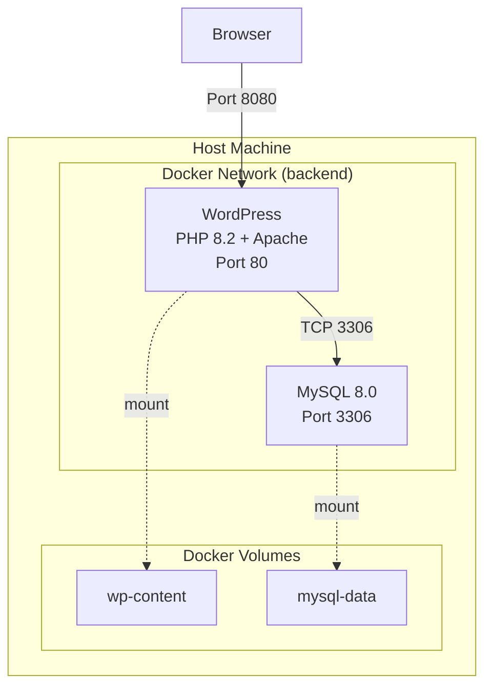
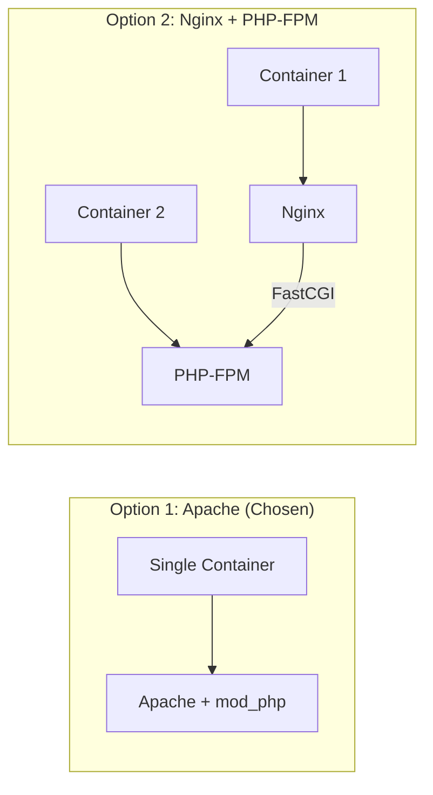

# Phase 1: WordPress Docker Setup

## Architecture Overview

This phase establishes the foundation of the DevOpsBegins Blog platform using Docker containers.



## Components

### WordPress Container

| Property | Value |
|----------|-------|
| Base Image | `php:8.2.29-apache` |
| WordPress Version | 6.9 (SHA1 verified) |
| PHP Extensions | mysqli, gd, zip, exif, intl, opcache, imagick |
| Exposed Port | 80 (mapped to host 8080) |

**PHP Configuration:**
- Memory limit: 256MB
- Upload max filesize: 64MB
- Post max size: 64MB
- Max execution time: 300s

**OPcache Settings:**
- Memory: 128MB
- Revalidate frequency: 60s
- Max accelerated files: 10000

### MySQL Container

| Property | Value |
|----------|-------|
| Image | `mysql:8.0` |
| Character Set | utf8mb4 |
| Collation | utf8mb4_unicode_ci |
| Authentication | mysql_native_password |

### Network Configuration

- **Network Type:** Bridge (internal)
- **Network Name:** backend
- **MySQL Exposure:** Internal only (not exposed to host)
- **WordPress Exposure:** Port 8080 on host

### Data Persistence

| Volume | Container Path | Purpose |
|--------|----------------|---------|
| `devopsbegins-wp-content` | `/var/www/html/wp-content` | Themes, plugins, uploads |
| `devopsbegins-mysql-data` | `/var/lib/mysql` | Database files |

## Architecture Decision: Apache vs Nginx

### Decision

Use Apache (via `php:8.2-apache`) as the web server instead of Nginx + PHP-FPM.

### Context

WordPress requires both static file serving and PHP processing. Two common architectures exist:



### Rationale

For Phase 1, Apache was chosen because:

| Factor | Apache | Nginx + PHP-FPM |
|--------|--------|-----------------|
| Complexity | Single container | Two containers |
| Configuration | `.htaccess` works natively | Requires conversion |
| WordPress compatibility | Native support | Additional setup |
| Resource usage | Higher memory | Lower memory |
| Performance at scale | Good for moderate traffic | Better for high traffic |

**Key reasons:**
1. **Simplicity** - Single container reduces operational complexity
2. **WordPress compatibility** - `.htaccess` rules work without conversion
3. **Educational value** - Easier to understand for beginners
4. **Sufficient performance** - Apache handles moderate traffic well

### Future Consideration

If traffic scales significantly, consider migrating to Nginx + PHP-FPM architecture in a future phase.

## Quick Start

```bash
# Start services
docker compose -f standalone-docker-compose.yml up -d

# Check status
docker compose -f standalone-docker-compose.yml ps

# View logs
docker compose -f standalone-docker-compose.yml logs -f

# Stop services
docker compose -f standalone-docker-compose.yml down
```

## Access

- **WordPress:** http://localhost:8080
- **MySQL:** Internal only (accessible from WordPress container)

## Troubleshooting

### Container won't start

```bash
# Check logs
docker compose -f standalone-docker-compose.yml logs wordpress
docker compose -f standalone-docker-compose.yml logs mysql

# Verify network
docker network ls | grep backend
```

### Database connection error

```bash
# Verify MySQL is healthy
docker compose -f standalone-docker-compose.yml ps mysql

# Test connection from WordPress container
docker exec devopsbegins-wordpress \
  php -r "new mysqli('mysql', 'wordpress', 'wordpress_secret_2024', 'wordpress');"
```

### Permission issues with wp-content

```bash
# Fix permissions
docker exec devopsbegins-wordpress \
  chown -R www-data:www-data /var/www/html/wp-content
```

### Clean restart

```bash
# Remove containers, networks, and volumes
docker compose -f standalone-docker-compose.yml down -v

# Start fresh
docker compose -f standalone-docker-compose.yml up -d
```

## Environment Variables

| Variable | Service | Default Value |
|----------|---------|---------------|
| `WORDPRESS_DB_HOST` | wordpress | mysql |
| `WORDPRESS_DB_NAME` | wordpress | wordpress |
| `WORDPRESS_DB_USER` | wordpress | wordpress |
| `WORDPRESS_DB_PASSWORD` | wordpress | wordpress_secret_2024 |
| `MYSQL_DATABASE` | mysql | wordpress |
| `MYSQL_USER` | mysql | wordpress |
| `MYSQL_PASSWORD` | mysql | wordpress_secret_2024 |
| `MYSQL_ROOT_PASSWORD` | mysql | root_secret_2024 |

## Next Steps

- **Phase 2:** Add automated backup system
- **Phase 3:** Implement SSL/TLS with Let's Encrypt
- **Phase 4:** Set up monitoring and logging
