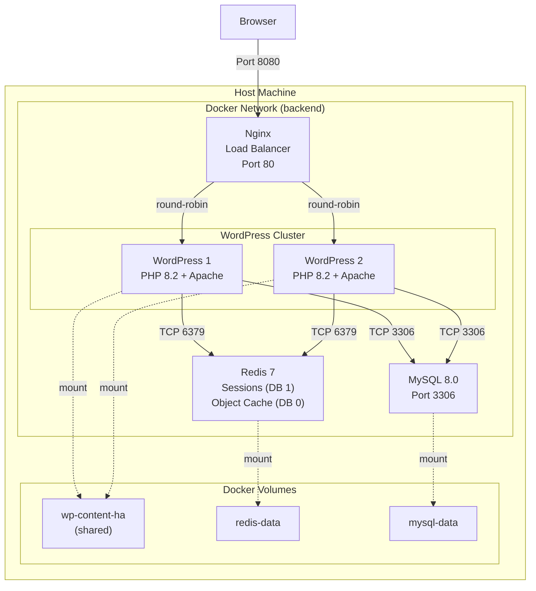

# Phase 2: WordPress High Availability

## Architecture Overview

This phase extends the foundation from Phase 1 to support horizontal scaling with session persistence and shared storage.



## Components

### Nginx Load Balancer

| Property | Value |
|----------|-------|
| Image | `nginx:alpine` |
| Role | Reverse proxy, load balancer |
| Algorithm | Round-robin |
| Exposed Port | 80 (mapped to host 8080) |

**Features:**
- Health checks every 30 seconds
- Automatic failover on node failure
- `X-Served-By` header for debugging
- Proxy headers for real client IP

### WordPress Replicas

| Property | Value |
|----------|-------|
| Base Image | `php:8.2.29-apache` (custom) |
| Replicas | 2 (wordpress-1, wordpress-2) |
| PHP Extensions | mysqli, gd, zip, exif, intl, opcache, imagick, redis |
| Session Handler | Redis (DB 1) |

**New Capabilities:**
- PHP Redis extension for sessions and object cache
- WP-CLI pre-installed for automation
- Automatic wp-content seeding from base image
- Runtime Redis session configuration

### Redis Server

| Property | Value |
|----------|-------|
| Image | `redis:7-alpine` |
| Port | 6379 (internal only) |
| Persistence | AOF (Append Only File) |
| Max Memory | 256MB |
| Eviction Policy | allkeys-lru |

**Database Separation:**
| Database | Purpose | Key Pattern |
|----------|---------|-------------|
| DB 0 | WordPress Object Cache | `wp_*`, transients |
| DB 1 | PHP Sessions | `PHPREDIS_SESSION:*` |

### MySQL Container

Same configuration as Phase 1, shared between standalone and HA modes.

## Network Configuration

- **Network Type:** Bridge (internal)
- **Network Name:** backend
- **Service Discovery:** Docker DNS (service names)
- **External Access:** Only via Nginx on port 8080

## Data Persistence

| Volume | Container Path | Purpose |
|--------|----------------|---------|
| `devopsbegins-wp-content-ha` | `/var/www/html/wp-content` | Shared themes, plugins, uploads |
| `devopsbegins-redis-data` | `/data` | Redis AOF persistence |
| `devopsbegins-mysql-data` | `/var/lib/mysql` | Database files |

## Architecture Decisions

### Decision 1: Redis for Sessions vs Sticky Sessions

**Decision:** Use Redis-backed PHP sessions instead of Nginx sticky sessions.

**Rationale:**

| Factor | Redis Sessions | Sticky Sessions |
|--------|----------------|-----------------|
| Failover | Seamless | Session lost |
| Load distribution | Even | Can be uneven |
| Scalability | Horizontal | Limited |
| Complexity | Moderate | Simple |

Redis sessions were chosen because:
1. **True HA** - User sessions survive node failures
2. **Even load** - All nodes can serve any request
3. **Scalability** - Add nodes without session affinity concerns

### Decision 2: Shared Volume vs Object Storage

**Decision:** Use Docker shared volume for wp-content instead of S3/MinIO.

**Rationale:**

| Factor | Shared Volume | Object Storage |
|--------|---------------|----------------|
| Complexity | Low | High |
| Performance | Native filesystem | Network latency |
| WordPress compatibility | Full | Requires plugins |
| Cost | Free | Storage costs |

Shared volume was chosen because:
1. **Simplicity** - No additional services or plugins
2. **Compatibility** - All WordPress features work natively
3. **Educational** - Demonstrates volume sharing concepts
4. **Sufficient** - Works well for moderate scale

### Decision 3: Redis DB Separation

**Decision:** Use separate Redis databases for sessions (DB 1) and object cache (DB 0).

**Rationale:**
1. **Isolation** - Cache flush doesn't affect sessions
2. **Debugging** - Easy to inspect each concern separately
3. **TTL management** - Different expiration policies per use case

## Quick Start

```bash
# Start HA environment
docker compose -f docker-compose.ha.yml up -d

# Check all services
docker compose -f docker-compose.ha.yml ps

# View logs
docker compose -f docker-compose.ha.yml logs -f

# Test load balancing
for i in {1..10}; do curl -sI http://localhost:8080 | grep X-Served-By; done

# Stop services
docker compose -f docker-compose.ha.yml down
```

## Access

- **WordPress:** http://localhost:8080 (via Nginx)
- **Redis:** Internal only (accessible from WordPress containers)
- **MySQL:** Internal only (accessible from WordPress containers)

## Verifying HA Setup

### Test Session Persistence

```bash
# Run the session persistence test
./scripts/tests/test-session-persistence.sh
```

This test:
1. Creates a session on one node
2. Makes requests that hit different nodes
3. Verifies session data persists across nodes

### Test Object Cache

```bash
# Run the object cache test
./scripts/tests/test-object-cache.sh
```

This test:
1. Verifies Redis connection from WordPress
2. Tests wp_cache operations
3. Confirms cache sharing between nodes

### Test Load Distribution

```bash
# Check which node serves each request
for i in {1..10}; do
    curl -sI http://localhost:8080 | grep X-Served-By
    sleep 0.5
done
```

Expected output alternates between `wordpress-1` and `wordpress-2`.

### Run All Tests

```bash
# Run complete test suite
./scripts/tests/run-all-tests.sh ha
```

## Troubleshooting

### Redis Connection Failed

```bash
# Verify Redis is running
docker compose -f docker-compose.ha.yml ps redis

# Test Redis connectivity
docker compose -f docker-compose.ha.yml exec redis redis-cli ping

# Check Redis logs
docker compose -f docker-compose.ha.yml logs redis
```

### Sessions Not Persisting

```bash
# Verify session handler
docker compose -f docker-compose.ha.yml exec wordpress-1 \
  php -r "echo ini_get('session.save_handler');"
# Expected: redis

# Check sessions in Redis
docker compose -f docker-compose.ha.yml exec redis \
  redis-cli -n 1 KEYS "PHPREDIS_SESSION:*"
```

### Load Balancer Issues

```bash
# Check Nginx config
docker compose -f docker-compose.ha.yml exec nginx nginx -t

# View Nginx logs
docker compose -f docker-compose.ha.yml logs nginx

# Test upstream health
docker compose -f docker-compose.ha.yml exec nginx \
  curl -s http://wordpress-1:80 -o /dev/null -w "%{http_code}"
```

### Shared Volume Issues

```bash
# Create file on node 1, verify on node 2
docker compose -f docker-compose.ha.yml exec wordpress-1 \
  touch /var/www/html/wp-content/test-file.txt

docker compose -f docker-compose.ha.yml exec wordpress-2 \
  ls -la /var/www/html/wp-content/test-file.txt

# Cleanup
docker compose -f docker-compose.ha.yml exec wordpress-1 \
  rm /var/www/html/wp-content/test-file.txt
```

### Clean Restart

```bash
# Remove containers and volumes (except MySQL for faster restart)
docker compose -f docker-compose.ha.yml down
docker volume rm devopsbegins-wp-content-ha devopsbegins-redis-data

# Start fresh
docker compose -f docker-compose.ha.yml up -d
```

## Environment Variables

| Variable | Service | Default Value |
|----------|---------|---------------|
| `WORDPRESS_MODE` | wordpress | ha |
| `WORDPRESS_DB_HOST` | wordpress | mysql |
| `WORDPRESS_DB_NAME` | wordpress | wordpress |
| `WORDPRESS_DB_USER` | wordpress | wordpress |
| `WORDPRESS_DB_PASSWORD` | wordpress | wordpress_secret_2024 |
| `REDIS_HOST` | wordpress | redis |
| `REDIS_PORT` | wordpress | 6379 |
| `WP_REDIS_HOST` | wordpress | redis |
| `WP_REDIS_PORT` | wordpress | 6379 |
| `WP_REDIS_DATABASE` | wordpress | 0 |

## Configuration Files

| File | Purpose |
|------|---------|
| `docker-compose.ha.yml` | HA mode orchestration |
| `config/nginx/nginx.conf` | Load balancer configuration |
| `.env.example` | Environment variable template |

## Comparison: Standalone vs HA Mode

| Feature | Standalone | High Availability |
|---------|------------|-------------------|
| WordPress instances | 1 | 2+ |
| Load balancer | No | Nginx |
| Session storage | Files | Redis |
| Object cache | Optional | Redis |
| Shared storage | Local | Docker volume |
| Failover | None | Automatic |
| Use case | Development | Production |

## Next Steps

- **Phase 3:** Add automated backup system for volumes and database
- **Phase 4:** Implement SSL/TLS with Let's Encrypt
- **Phase 5:** Set up monitoring and logging with Prometheus/Grafana
